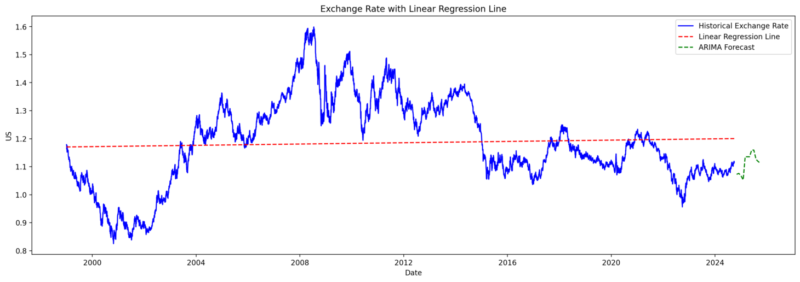

# Exchange Rate Forecast
Exchange Rate Forecast using an ARIMA (AutoRegressive Integrated Moving Average) model.

## Overview
This project aims to analyze and predict the exchange rate between the Euro (EUR) and the US Dollar (USD) using historical exchange rate data.

## Dataset
This project utilizes the **Euro Exchange Daily Rates** dataset, which contains daily exchange rates between the Euro and various currencies from 04 Jan 1999 - 27 Sept 2024. The dataset is sourced from Kaggle and can be accessed at the following link: [Euro Exchange Daily Rates (1999-2020)](https://www.kaggle.com/datasets/lsind18/euro-exchange-daily-rates-19992020).

### Dataset Overview
- **Date Range**: The dataset includes daily exchange rates from 04 Jan 1999 - 27 Sept 2024.
- **Columns**:
  - **Date**: The date of the exchange rate.
  - **Currency**: The currency against which the Euro exchange rate is provided.
  - **Exchange Rate**: The value of one Euro in the corresponding currency.

### How to Use
To use this dataset in your project, ensure that the data file is in CSV format and located in the appropriate directory. 
```bash
pip install -r requirements.txt
```
```bash
streamlit run exchange_rate_forecast.py
```
Once the application is running, it will automatically open in your web browser at  ```http://localhost:8501```.




# ARIMA Model
The ARIMA (AutoRegressive Integrated Moving Average) model is a popular statistical method for time series forecasting. It combines three key components:
- **AR (AutoRegressive)**: A model that uses the dependency between an observation and a number of lagged observations.
- **I (Integrated)**: The process of differencing the data to make it stationary.
- **MA (Moving Average)**: A model that uses the dependency between an observation and a residual error from a moving average model applied to lagged observations.

## ARIMA Formula
The ARIMA model is generally represented as **ARIMA(p, d, q)**, where:
- **p**: Number of lag observations included in the model (AR term).
- **d**: Number of times the raw observations are differenced (I term).
- **q**: Size of the moving average window (MA term).

The model can be expressed as:

**Y_t = φ₁Y_{t-1} + φ₂Y_{t-2} + ... + φₚY_{t-p} + θ₁ε_{t-1} + θ₂ε_{t-2} + ... + θₖε_{t-q} + ε_t**

Where:
- **Y_t** is the value at time **t**.
- **φᵢ** are the autoregressive parameters.
- **θᵢ** are the moving average parameters.
- **ε_t** is the white noise (error term).

# Using AutoTS for ARIMA
The AutoTS library automates the process of selecting ARIMA parameters and fitting the model.

## Conclusion

This project is currently in the testing phase. The aim is to analyze and predict the EUR/USD exchange rate using various statistical and machine learning techniques. 
